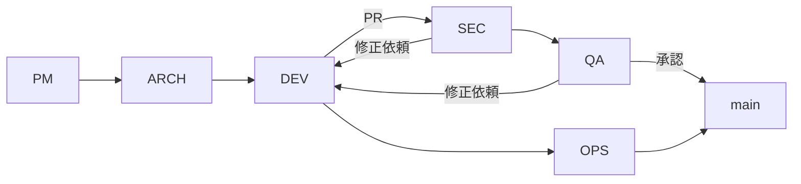

# AGENTS.md（正規版 v1）

> プロジェクト: Firefox ブックマーク Web 管理アプリ
> バージョン: v1.0
> 作成日: 2025-10-04 (JST)
> 参照関係: `requirements.md v1` → `design.md v1` → `CONTRIBUTING.md v1` → 本書

---

## 0. 概要

* **目的**: GPT-Codex を含む AI エージェントが、要件と設計に沿った安全な自動実装・レビュー補助を行うための分担表
* **範囲**: アーキ設計、コード生成、セキュリティ検証、テスト、運用、進行管理
* **原則**:

  1. 要件・設計に矛盾する生成は行わない
  2. 出力は常に CI/CD ゲート（Lint・型・pytest・SAST・依存スキャン）を通過する
  3. 秘密情報・認証情報は入力禁止

---

## 1. エージェント編成（Roster）

| Agent ID | ロール      | 主担当        | 入力            | 出力                |
| -------- | -------- | ---------- | ------------- | ----------------- |
| ARCH     | アーキテクト   | 設計整合・方針提示  | 要件/設計         | タスク分解・設計指針        |
| DEV      | 実装       | コード生成・補助   | タスク仕様・設計差分    | コード/PR（pytest 同梱） |
| SEC      | セキュリティ   | 脆弱性検証      | ソース・依存・CI 成果物 | 脆弱性レポート・修正提案      |
| QA       | テスト/品質   | 自動テスト設計・実装 | 要件・コード        | pytest・カバレッジレポート  |
| OPS      | 運用/監視    | 可観測性・IaC   | 監視要件・ログ・メトリクス | ダッシュボード・Runbook   |
| PM       | プロジェクト管理 | 優先度/進行管理   | バックログ・変更要求    | タスク割当・リリースノート     |

---

## 2. 役割別プロンプト（要点）

* **ARCH**: 要件逸脱の検出、DoD（Definition of Done）の定義
* **DEV**: 小規模 PR を高頻度で生成、必ず pytest 付き
* **SEC**: Bandit/依存スキャン/pip-audit 結果を評価、Waiver は期限必須
* **QA**: 境界値・不変性テストを設計、pytest で自動化
* **OPS**: ヘルスチェック、メトリクス、監査ログの IaC 化
* **PM**: タスク優先度、Issue 整理、CHANGELOG への反映

---

## 3. ルーティングとゲート

* **入口**: PM が Issue を定義 → ARCH が分解 → DEV に渡す
* **出口**: DEV の PR は **SEC・QA 承認必須**、OPS は監視/本番影響タスクで必須

---

## 4. 入出力契約（Contracts）

* **入力**: Issue/タスクの受け入れ基準、`requirements.md v1`・`design.md v1`
* **出力**: コード、pytest、SBOM、脆弱性レポート、ドキュメント差分
* **DoD**:

  * pytest 全緑
  * Lint/型/静的解析エラー 0
  * 脆弱性 Critical/High = 0
  * ドキュメント更新済み

---

## 5. ツール & 権限

* **Git**: DEV は feature ブランチのみ書込可。`main` は PR + レビュー必須
* **CI/CD**: GitHub Actions → Ruff, Black, mypy, Bandit, djLint, pip-audit, detect-secrets, pytest
* **Secrets**: 環境変数/Secret Manager 利用。リポジトリ直書き禁止
* **DB**: CI/開発で Postgres を利用。マイグレーションは PR レビュー対象

---

## 6. セキュリティガードレール

* 秘密情報/PII の入力禁止
* 外部 API 送信禁止（設計外）
* Waiver（例外許可）は期限・根拠・再評価日を Issue に記録

---

## 7. コンテキスト管理

* 参照優先度: `requirements.md v1` → `design.md v1` → `CONTRIBUTING.md v1` → Issue → コード
* 長大な履歴は要約＋チャンク化してコンテキストを維持
* 会話/議論の要点は必ず Issue コメントに残す

---

## 8. メトリクス

* **品質**: ビルド成功率、pytest 成功率、カバレッジ ≥ 80%
* **セキュリティ**: 脆弱性 Critical/High 件数、修正リードタイム
* **フロー**: リードタイム、PR サイクルタイム、デプロイ頻度、変更失敗率

---

## 9. リリース運用

* **ブランチ戦略**: GitHub Flow（`main` 保護、feature/fix/chore）
* **リリース**: タグ `vX.Y.Z`、CHANGELOG 生成、リリースノート記録
* **ロールバック**: Runbook に復旧手順記載（DB 復元手順含む）

---

## 付録: RACI

| 項目     | R    | A  | C        | I       |
| ------ | ---- | -- | -------- | ------- |
| タスク分解  | ARCH | PM | DEV/SEC  | QA/OPS  |
| 実装     | DEV  | PM | ARCH/QA  | SEC/OPS |
| セキュリティ | SEC  | PM | DEV/ARCH | QA/OPS  |
| リリース   | PM   | PM | OPS/SEC  | 全員      |

