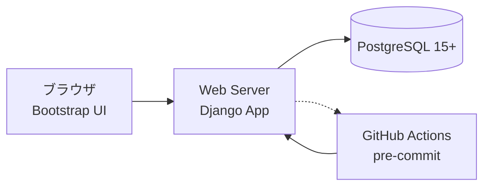

# design.md

> プロジェクト: Firefox ブックマーク Web 管理アプリ
> バージョン: v1.0
> 作成日: 2025-10-04 (JST)
> 参照関係: `requirements.md v1` → 本書 → `CONTRIBUTING.md` → `AGENTS.md`

---

## 1. アーキテクチャ概要

### 1.1 技術選定

* 言語: **Python 3.12**
* Web フレームワーク: **Django 5.x**
* DB: **PostgreSQL 15+**
* UI: **Bootstrap**（Django Template）
* テスト: **pytest / pytest-django**
* インフラ: Docker Compose 単一ノード構成

### 1.2 構成図



* **User**: ブックマークを閲覧/検索/編集
* **Web**: Django アプリケーション（インポート処理・タグ管理・検索）
* **DB**: PostgreSQL、正規化・インデックス最適化済
* **CI**: GitHub Actions により Lint/型/静的解析/テスト/セキュリティゲート実行

---

## 2. モジュール構成

| モジュール           | 主な役割                                                                        |
| --------------- | --------------------------------------------------------------------------- |
| core/           | 共通設定・ユーティリティ（URL 正規化、validators、middleware）                                 |
| accounts/       | 認証・権限管理（Admin/Editor/Viewer）                                                |
| bookmarks/      | Bookmark/Tag モデル、サービス層（importer, dedupe, tag_resolver, exporter）、ビュー、テンプレート |
| bookmarks/admin | Django Admin カスタム（タグツリー検索、重複管理）                                             |
| history/        | 操作履歴の保存と閲覧                                                                  |

---

## 3. データベース設計

### 3.1 ER 図

```mermaid
erDiagram
  BOOKMARK ||--o{ BOOKMARK_TAG : has
  TAG ||--o{ BOOKMARK_TAG : has
  BOOKMARK ||--o{ HISTORY : changes

  BOOKMARK {
    uuid id PK
    text title
    text url
    text url_norm_hash UNIQUE
    text description
    text source_guid
    text source_path
    datetime created_at
    datetime updated_at
  }

  TAG {
    uuid id PK
    text name
    text slug
    uuid parent_id FK
    text path_cache
    int lft
    int rgt
    int level
    datetime created_at
    datetime updated_at
  }

  BOOKMARK_TAG {
    uuid bookmark_id FK
    uuid tag_id FK
    PK "bookmark_id + tag_id"
  }

  HISTORY {
    uuid id PK
    uuid actor_id
    text entity_type
    uuid entity_id
    text action
    jsonb payload
    datetime created_at
  }
```

### 3.2 インデックス設計

* `bookmark.url_norm_hash`: UNIQUE インデックス
* `tag.(parent_id, name)`: UNIQUE 制約
* `tag.(lft, rgt)`: MPTT 用インデックス
* 検索用: `title`/`url` に trigram / FTS GIN インデックス
* `history.entity_type + entity_id`: 複合インデックス

---

## 4. インポート設計

1. **JSON アップロード & 検証**

   * ファイル種別/サイズ/JSON スキーマ検証
   * プレビュー画面で統計表示（フォルダ/ブックマーク数、新規/更新/重複）
2. **ツリー走査**

   * `placesRoot` 配下を再帰走査
   * フォルダ → Tag（upsert、親子保持）
3. **ブックマーク登録**

   * Bookmark 保存、所属タグ全付与
   * `url_norm_hash` による重複検出（スキップ/更新/マージ）
4. **コミット**

   * DB トランザクションで原子性を確保
5. **監査ログ**

   * 成果（作成/更新/スキップ/重複）を History に記録

---

## 5. UI 設計

* **レイアウト**: 左ペイン＝タグツリー、右ペイン＝ブックマーク一覧/詳細
* **タグツリー**

  * 折り畳み可能
  * 子数/件数バッジ表示
  * コンテキストメニュー: 改名/移動/結合/削除
* **ブレッドクラム**

  * 現在のタグパスを表示
* **一覧**

  * ページング、検索（キーワード/タグ AND・OR/子孫タグ包含）
* **詳細**

  * タイトル、URL、説明、付与タグ一覧、重複候補、履歴
* **アクセシビリティ**

  * キーボード操作、スクリーンリーダー対応、日本語ラベル明示

---

## 6. セキュリティ設計

* **認証**: Django 標準 auth（PBKDF2 → 将来 Argon2 切替）
* **権限**: Admin / Editor / Viewer（Group/Permission ベース）
* **CSRF**: Django middleware 標準
* **XSS**: テンプレート autoescape、CSP (`script-src 'self'`)
* **入力検証**: ファイル拡張子/サイズ/JSON スキーマ
* **ログ/監査**: 認証・インポート・タグ/ブックマーク操作を History に記録
* **Secrets**: `.env` / Secret Manager、リポジトリ直書き禁止

---

## 7. テスト戦略

* **pytest** + `pytest-django`
* 階層別テスト:

  * Unit: URL 正規化、タグパス生成、木構造走査
  * Service: importer, dedupe, exporter
  * View: Django test client（検索、フィルタ、認可、CSRF）
  * Admin: 基本操作の UI テスト
* **E2E**: 実サンプル JSON を取り込み、要件通りにタグ付与・重複検出されるか確認
* **基準**: 80%以上のカバレッジ（CI で enforce）

---

## 8. CI/CD 概要

### 8.1 GitHub Actions

* **Lint**: Ruff, Black
* **型検査**: mypy (`django-stubs`)
* **静的解析**: Bandit, djLint, detect-secrets
* **依存脆弱性**: pip-audit
* **Django Checks**: `makemigrations --check`, `check --deploy`
* **テスト**: pytest (Postgres サービス起動)
* **成果物**: pytest レポート、カバレッジ、将来 SBOM

### 8.2 pre-commit

* Black, Ruff, mypy, Bandit, djLint, pip-audit, detect-secrets
* Docstring/行長の検査（Ruff D 規則 + Black 88文字）

---

## 9. 運用・監視設計

* **ヘルスチェック**: `/healthz`（DB 接続・マイグレーション整合）
* **ログ**: JSON 形式、request_id 付与
* **メトリクス**:

  * HTTP レイテンシ、エラー率
  * インポート件数・失敗率
  * タグ操作件数
* **バックアップ**: 日次 `pg_dump`
* **リリース**: GitHub Flow、タグ付けリリース（vX.Y.Z）
* **ロールバック**: Runbook に復元手順明記

---

## 10. リスク対策

| リスク       | 対応策                      |
| --------- | ------------------------ |
| 巨大ツリー描画遅延 | 遅延ロード/仮想リスト、DB インデックス最適化 |
| URL 正規化差異 | 共通ユーティリティ + ユニットテスト固定化   |
| タグ誤結合     | 確認モーダル + History から復旧    |
| インポート失敗   | トランザクション処理、リトライ実行        |

---

## 11. 変更管理
